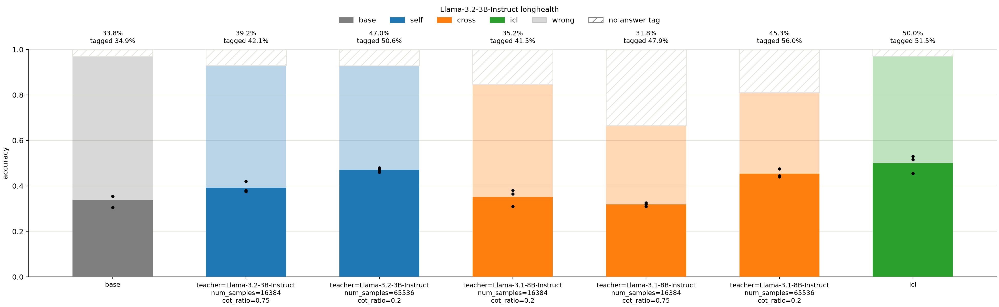
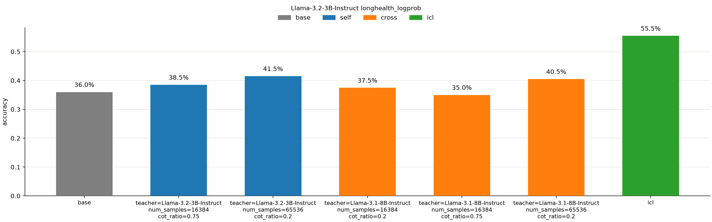

# cross distill cart

## 배경

[Cartridges](https://arxiv.org/abs/2506.06266) 논문에서는 긴 문서를 매번 프롬프트에 넣는 대신, 문서마다 작은 kv cache인 cartridge를 미리 학습해 이를 대신 사용하는 방법을 제안. 이때 cartridge 학습에는 self-study를 사용. 이는 모델이 문서를 보고 스스로 질문과 답을 만들어, 문서 없이 cartridge만 넣은 모델이 문서를 본 자기 자신의 답 분포를 따라가도록 context distillation으로 학습하는 방식.

논문의 방식은 자기 자신의 답변을 보고 학습하는, 즉 teacher와 student가 같은 self distillation. 그런데 애초에 distillation의 기원이 상위 모델로부터의 지식 전수. 그렇다면 상위 모델을 teacher로 쓰면 상위 모델의 문제 해결 흐름을 바탕으로 더 좋은 cartridge를 얻을 수 있을 거라고 생각. 따라서 cross distillation으로 cartridge의 성능이 오르는지 확인.

## 실험 설정

student는 llama-3.2-3b-instruct를 사용. teacher는 student 자신과 llama-3.1-8b-instruct를 사용. 문서는 논문과 같이 longhealth의 환자 10명 기록을 사용.

synthesis 데이터는 논문의 self-study를 따름. 환자 정보와 노트 하나를 context로 하여, structuring, summarization, question, use case, creative 다섯 종류의 seed_prompt로 teacher가 temperature 0.6, 최대 512 토큰으로 질문 생성. 질문의 일부에 다양한 형식의 cot_prompt를 붙이고 teacher가 같은 context로 temperature 0, 최대 1024 토큰으로 답 생성. 답의 토큰마다 teacher의 top-20 logprob을 저장하여 cartridge 학습에 사용. 두 teacher 모두 cot 0.75 16384개와, cot 비율을 논문 레포의 llama synthesis와 같은 0.2로 낮추고 데이터를 늘린 cot 0.2 65536개를 생성. 8b teacher는 데이터 양의 효과만 따로 보기 위해 cot 0.2 16384개도 생성.

cartridge는 2048 토큰으로, 논문을 따라 문서와 상관없는 텍스트의 kv cache로 초기화하되 gradient.txt 대신 wikitext-2를 사용. 맨 앞 bos는 sink로 고정하고 나머지만 학습. 학습은 cartridge만 붙인 student가 cot_prompt가 붙은 질문을 보고 teacher의 답을 따라 읽을 때, 답 토큰마다 teacher top-20 분포와의 cross entropy 최소화. AdamW로 lr 2e-2, weight decay 0, epoch 2, batch 64로 학습.

평가는 아무것도 모르는 base, 환자 10명 기록 전체를 프롬프트에 넣은 icl, cartridge를 비교. longhealth는 환자 10명의 객관식 200문제. 채점 방식은 두 가지. longhealth는 논문의 cot 프롬프트와 temperature 0.3을 따라 답을 생성하고 \<answer> 태그 안의 답과 가장 가까운 선택지로 채점하고, 태그를 닫지 못하면 오답. seed는 3개이고, 최대 생성 길이는 답변이 잘리는 걸 고려하여 논문의 512 대신 1024 토큰으로. longhealth_logprob은 생성 없이 cot 지시를 뺀 프롬프트로 선택지 다섯 개를 각각 질문에 이어붙여서 선택지 토큰의 평균 logprob을 비교해 가장 높은 것으로 평가. 생성에서의 형식 실수나 샘플링 노이즈 없이 보기 위함.

## 결과

longhealth 생성 정확도는 base 33.8%, icl 50.0%. cot 0.75 16384개로 학습한 cartridge는 self 39.2%, cross 31.8%로 base 근처이고, cross를 cot 0.2 16384개로 바꿔도 35.2%. synthesis를 cot 0.2 65536개로 늘리면 self 47.0%, cross 45.3%로 크게 오르고, seed 간 차이도 줄어듦. 같은 cot 0.2인 cross가 16384개에서 35.2%였으므로, 결국 차이는 데이터 양에서 옴. 한편 기대했던 것과 달리 self와 cross의 차이는 거의 없고 오히려 self가 약간 높음.

cross는 답의 19%에서 \<answer> 형식을 지키지 못해 self의 7%보다 많음. 형식을 지킨 답만 따지면 cross가 56.0%로 self 50.6%, icl 51.5%보다 높아, cross의 추론 자체는 더 낫다고 해석할 여지는 있음. 다만 형식을 지킨 답이 쉬운 문제에 몰렸을 수 있어 함부로 판단하기는 어려움. 형식을 닫지 못한 cross의 답은 75%가 최대 생성 길이에 걸렸고 47%는 같은 줄을 반복.

생성 없이 logprob으로 채점하면 icl은 55.5%로 base 36.0%보다 확연히 높음. 16384개 cartridge는 35.0~38.5%로 모두 base와 비슷하고, 65536개에서 self 41.5%, cross 40.5%로 base보다 높아짐. 하지만 아직까지도 icl보다 낮음.

## 결론

teacher를 8b로 바꾸더라도 cartridge의 성능은 좋아지지 않음. 아마도 자기보다 큰 모델의 섬세한 답 분포를 따라가다 보니 추론이 길어지고 반복에 빠지면서 형식이 무너지는 것으로 보임.

cartridge의 성능에 가장 중요한 요소는 데이터의 양. 65536개에서부터 생성 정확도가 icl 근처까지 올라옴. 논문 레포는 synthesis 약 20만 개를 2048 토큰 시퀀스로 이어 붙여 32개씩, 즉 step당 대화 약 200개 이상을 학습하므로, 현재 구현은 원본보다 훨씬 작음.

## 한계

데이터 규모가 원본보다 작다 보니 성능이 덜 나온 것일 수도 있고, 충분히 큰 규모에서는 teacher의 효과가 다르게 나타날 수도 있음. 또한 초기화 텍스트도 gradient.txt 대신 wikitext-2를 써 엄밀히는 원본과 다름. (근데 이 정도 synthesis가 있어야 icl 근처로 온다면, 근본적으로 cartridge가 별로인거 아닌가? 일단 최근에는 이 학습 과정을 개선하는 방향의 연구도 나오는 듯함...)

self의 65536개 실험은 데이터 양과 함께 cot 비율도 0.75에서 0.2로 바꿔, 두 효과를 따로 나누지 못함. 또한 16384개 synthesis는 고치기 전의 context 템플릿인 "consists of 1 notes."로 만들어, 65536개와 teacher가 보는 context가 조금 다름.

cross의 형식 실패가 1024 토큰에서 잘린 teacher 답 때문인지 보려고 잘린 답을 빼고 다시 학습했지만, 태그를 닫은 비율은 80%로 그대로였고 정확도도 cross 46.5%, self 47.2%로 비슷했음. 잘린 답은 8b가 9.0%, 3b가 6.0%.

cot_prompt는 저자 레포의 것을 그대로 가져와 \<thinking>, \<response>, \<final> 등 매우 다양한 태그로 답하는 데이터를 학습함. 이 때문에 작은 모델이 longhealth가 요구하는 \<answer> 형식을 지키기 더 어려웠을 수도 있지만, 따로 확인하지는 않음.
